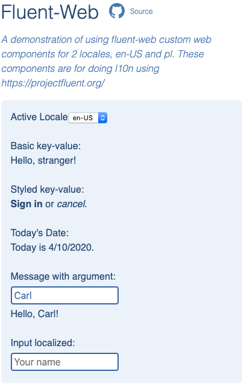

# fluent-web

A web component that uses [Fluent](https://projectfluent.org/) for localization.

[Interactive example](https://wolfadex.github.io/fluent-web/).

| Locale en-US                                            | Locale pl                                         |
| ------------------------------------------------------- | ------------------------------------------------- |
|  |  |

## Basic Usage:


```js
import { FluentResource } from "@fluent/bundle";

const resource = new FluentResource(`
hello = Hello, Fluent!
`);
const resource = [
  "en-US",
  resource,
];
const textEl = document.getElementById("my-text-element");

textEl.resource = resource;
```

HTML:

```html
<fluent-text id="my-text-element" messageId="hello"></fluent-text>
```

Result:

```
Hello, Fluent!
```

For how to build messages, see the [Fluent docs](https://github.com/projectfluent/fluent/wiki).

## Examples:

- [Elm](./src/example/elm), this is used for the interactive demo
- [Svelte](.src/example/svelte)
- [Vanilla HTML & JS](.src/example/vanillajs)

## Other:

### **_Note:_** No npm package is published yet so feel free to clone this repo or the clone `src/index.js` until then.

⚠️ WARNING ⚠️ This project is still in development and APIs are subject to change.

See the [Docs](./docs/index.md) for more details.
